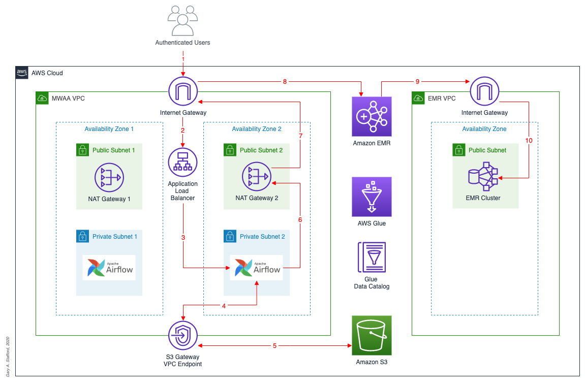

# Running PySpark Applications on Amazon EMR using Apache Airflow

## Overview

Project files for the post, [Running PySpark Applications on Amazon EMR using Apache Airflow: Using the new Amazon Managed Workflows for Apache Airflow (MWAA) on AWS](https://itnext.io/running-spark-jobs-on-amazon-emr-with-apache-airflow-2e16647fea0c). Please see post for complete instructions on using the project's files.

## Architecture

Below is the final high-level architecture for the post’s demonstration. The diagram shows the approximate route of a DAG Run request, in red. The diagram includes an optional S3 Gateway VPC endpoint, not detailed in the post, but recommended for additional security. 

